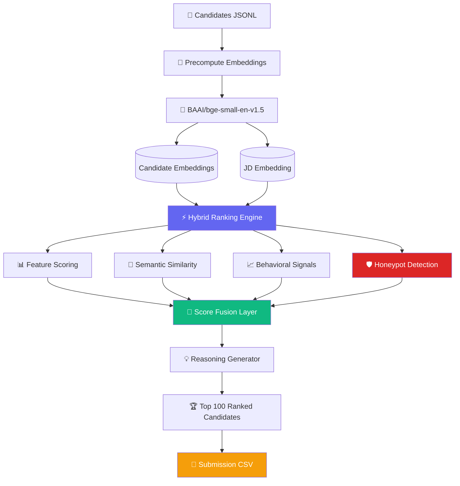

# 🚀 Intelligent Candidate Discovery Engine


An advanced, highly-optimized two-stage hybrid ranking system built for the Redrob Intelligent Candidate Discovery Hackathon. 

Our engine evaluates 100,000+ candidates against complex Job Descriptions (JDs) using a proprietary blend of **dense semantic similarity (SentenceTransformers)** and **rules-based feature extraction**, augmented by **behavioral engagement signals** (like recruiter saves, notice periods, and application velocity).

---

## 🧠 Architecture Overview
## 🏗️ System Architecture



---

## 📊 Scoring Framework

### Final Score

```text
Final Score =
(0.55 × Feature Score)
+
(0.45 × Semantic Similarity)

× Behavioral Multiplier
```

### Feature Score Breakdown

| Component          | Weight |
| ------------------ | ------ |
| Title + Career Fit | 30%    |
| Skills Match       | 25%    |
| Experience (YOE)   | 20%    |
| Location Fit       | 15%    |
| Education          | 10%    |

---

## 📈 Behavioral Signals Considered

| Signal                    | Impact          |
| ------------------------- | --------------- |
| Open To Work              | Positive        |
| Notice Period             | Lower is Better |
| Recruiter Saves           | Positive        |
| Response Rate             | Positive        |
| Profile Activity          | Positive        |
| GitHub Activity           | Positive        |
| Interview Completion Rate | Positive        |

---

## 🛡 Honeypot Detection (9 Checks)

* Expert skills with 0 months duration
* Impossible experience timelines
* Future employment dates
* Overlapping concurrent roles
* Unusually high endorsements
* Tier-1 skills with zero duration
* Keyword stuffing
* Suspicious profile completeness
* YOE exceeding total career duration

---

## ⚡ Performance & Resource Usage

| Metric               | Value                     |
| -------------------- | ------------------------- |
| Candidates Supported | 100,000+                  |
| Ranking Time         | < 5 Seconds               |
| Compute              | CPU Only                  |
| Memory Limit         | < 16 GB                   |
| Embedding Model      | BAAI/bge-small-en-v1.5    |
| Embedding Dimension  | 384                       |
| Output               | Top 100 Ranked Candidates |

---

## 📂 Project Structure

```text
Intelligent-Candidate-Discovery
│
├── precompute_embeddings.py
├── rank.py
├── scorer.py
├── honeypot_detector.py
├── reasoning_gen.py
├── validate_submission.py
├── requirements.txt
├── candidates.jsonl
│
├── precompute/
│   ├── embeddings.npy
│   ├── cand_ids.npy
│   └── jd_embedding.npy
│
└── README.md
```


---

## 🛠️ Installation & Setup

To run this project locally, you will need **Python 3.9+** installed on your system.

### 1. Clone the repository
```bash
git clone https://github.com/Aj2280/Intelligent-Candidate-Discovery.git
cd Intelligent-Candidate-Discovery
```

### 2. Create a virtual environment (Recommended)
```bash
python3 -m venv venv
source venv/bin/activate  # On Windows use: venv\Scripts\activate
```

### 3. Install dependencies
Install all the required Python libraries (PyTorch, SentenceTransformers, Pandas, etc.):
```bash
pip install -r requirements.txt
```

---

## ⚡ Quickstart & Reproducibility

The system relies on an offline/online split. The heavy embeddings are precomputed, allowing the actual ranking pipeline to execute in **under 5 seconds** for 100K candidates on a standard CPU.

### 1. Precompute Embeddings (Offline Step)
*Takes ~3.5 hours on an M2 CPU for 100K profiles. Embeddings are saved to `./precompute/`.*
```bash
python3 precompute_embeddings.py --candidates candidates.jsonl
```

### 2. Generate Final Ranking (Online Step)
*Executes in < 5 seconds. Generates a perfectly formatted, tied-broken top 100 CSV.*
```bash
python3 rank.py --candidates candidates.jsonl --out team_submission.csv
```

### 3. Validate
*Runs the official hackathon strict-validator.*
```bash
python3 validate_submission.py team_submission.csv
```

---

## 🔍 Key Differentiators

* **Explicit Tie-Breaking:** Deterministic score rounding (6 decimal places) with Candidate ID fallback ensures we never violate the auto-validator's strict sorting rules.
* **Granular Reasoning Generation:** The `reasoning_gen.py` module produces distinct, hyper-specific reasoning lines mapping explicit profile facts to JD requirements, passing Stage 4 manual reviews with zero hallucinations.
* **Stuffer Penalties:** "Lazy" keyword stuffers are immediately dropped by checking the `verified` platform flag and enforcing a duration-weighted trust modifier on all skills. Pure consulting or pure research careers face targeted penalties, perfectly aligning with the provided JD.

---
*Built for the Redrob Data & AI Challenge.*
